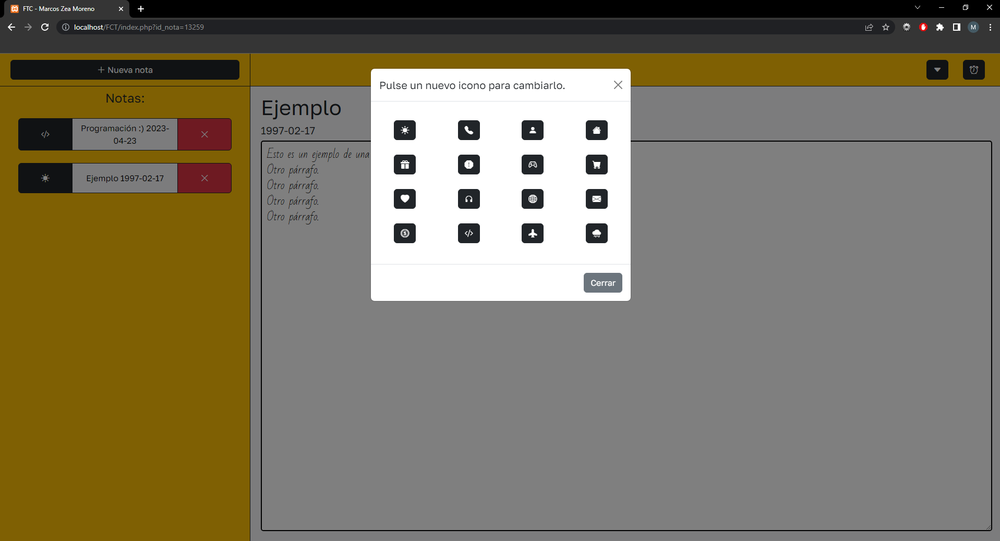
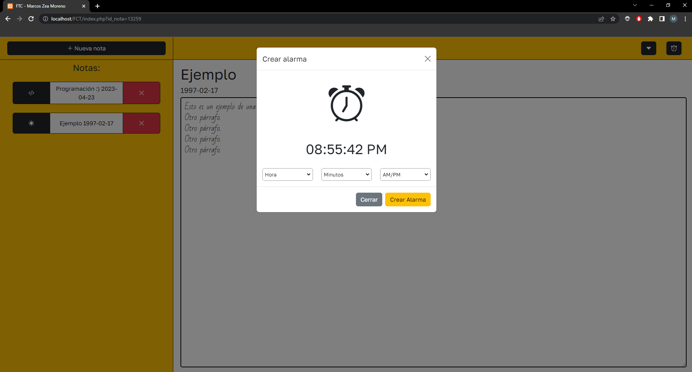

- [Gestor de Notas](#gestor-de-notas)
  - [Antecedentes](#antecedentes)
- [REQUISITOS](#requisitos)
  - [Requisitos funcionales](#requisitos-funcionales)
- [ANÁLISIS Y DISEÑO WEB](#análisis-y-diseño-web)
  - [Guía de estilos](#guía-de-estilos)
  - [Prototipo web y boceto de la estructura](#prototipo-web-y-boceto-de-la-estructura)
  - [Planificación de tareas](#planificación-de-tareas)
  - [Base de datos](#base-de-datos)
    - [Diseño Entidad Relación de la BBDD](#diseño-entidad-relación-de-la-bbdd)
    - [Modelo relacional BBDD](#modelo-relacional-bbdd)
    - [Script de creación BBDD](#script-de-creación-bbdd)
    - [Consultas](#consultas)
  - [Validación de formularios](#validación-de-formularios)
  - [Jerarquía de directorios](#jerarquía-de-directorios)
    - [Contenido directorios](#contenido-directorios)
  - [Diseño de la interface](#diseño-de-la-interface)
    - [Estructura gráfica de la interface](#estructura-gráfica-de-la-interface)
- [PRUEBAS](#pruebas)
  - [Diseño de casos de prueba](#diseño-de-casos-de-prueba)
  - [Implementación de pruebas](#implementación-de-pruebas)
  - [Análisis de resultados](#análisis-de-resultados)
- [DESPLIEGUE](#despliegue)
- [HERRAMIENTAS](#herramientas)
- [LENGUAJES](#lenguajes)
- [PRODUCTO](#producto)
  - [Página de Inicio](#página-de-inicio)
- [BIBLIOGRAFÍA](#bibliografía)

# Gestor de notas
## Antecedentes

El Gestor de Notas surge de la necesidad de tener un sistema para guardar notas que permita una personalización más completa y una mejor organización de las mismas.

# REQUISITOS
## Requisitos funcionales

R1: Registro de nota.
R1.1: El usuario deberá de rellanar la fecha y título de la nota.
R2: Administración de notas.
R2.2: El usuario podrá crearlas, editarlas y borrarlas.
R2.2: El usuario podrá escribir en ellas.


Además de los requisitos funcionales, están los siguientes:

- R1. Diseño responsive
- R2. Control de errores en formularios que deben incluir como mínimo un registro de notas.
- R2.1 El registro de notas contendrá los siguientes campos: 
  - Título
  - Fecha

# ANÁLISIS Y DISEÑO WEB
## Guía de estilos

Colores primarios corporativos:
- #f2b269
- #ffffff
Colores secundarios:
- #6c757d
- #000000
- #FF0000

## Prototipo web boceto de la estructura


## Logotipo


## Planificación de tareas


## Base de datos
### Diseño Entidad Relación de la BBDD

Realizamos el Esquema Entidad Relación de la BBDD de nuestra aplicación.

Se debe mostrar el diseño relacional. No lo que os muestra la aplicación MySQL Workbench o el gestor que usais. Quiero los diagrmas E-R con cajas para las entidades y rombos para las relaciones. Se deben tener en cuenta las cardinalidades.
### Modelo relacional BBDD

Se muestra el diseño de la BBDD según el GUI que esteís usando. Deben aparecer todas las entidades en la 3FN, los campos de las tablas y las cardinalidades.
### Script de creación BBDD

Scrip de creación de las BBDD, sin los datos. Cada una de las tablas con sus claves referenciadas. 

El lector debe comprender lo que está leyendo, no se pone el script sin más, hay que explicarlo.

### Consultas 

Se incluyen y describen todas las consultas que se emplean en el desarrollo del proyecto.

## Validación de formularios

En el siguiente formulario lo que validamos son los inputs con id "fecha" y "titulo". La validación de estos trata en exigir que el título contenga entre 3 y 3 carácteres del abecedario, y la fecha tiene que estar escrita en el formato "YYYY/MM/DD".
``` [html]
<form class="formulario" id="formulario" action="config/register.php" method="post">
  <div class="modal-body">
    <div class="mb-3">
      <label for="exampleFormControlInput1" class="form-label">Introduzca una fecha</label>
      <input type="text" id="fecha" name="reg_fecha" class="form-control" id="exampleFormControlInput1" placeholder="Ejemplo de fecha -> 2023/07/23" />
    </div>
    <div class="mb-3">
      <label for="exampleFormControlInput1" class="form-label">Introduzca un título</label>
      <input type="text" id="titulo" name="reg_titulo" class="form-control" id="exampleFormControlInput1" placeholder="Ejemplo de título -> Poema atardecer" />
    </div>
  </div>
  <div class="modal-footer">
    <button type="button" class="btn btn-secondary" data-bs-dismiss="modal">
      Cerrar
    </button>
    <input type="submit" name="crear" class="btn btn-warning boton" id="btn-agregar" value="Crear nota"></input>
  </div>
</form>
```

## Jerarquía de directorios


### Contenido directorios

> `./` -> Contiene los ficheros principales “index.php” y “style.css”.
> 
> `audio` -> Contiene el arcivo "ringtone.mp3" que básicamente es el tono de alarma.
> 
> `config` -> Contiene los archivos "borrar.php", "cambiar_icono.php", "database.php", "register_textarea.php" y "register.php".
> 
> `script` -> Contiene los archivos "alarma.js", "script.js" y "textarea.js".

## Diseño de la interface

> El sitio web consta de tres partes fundamentales. Esta estructura es común en todas las páginas que forman el sitio web.
> 
> **Cabecera**: Contiene 3 botones, el de creación de nota, el de cambiar icono, y por último un botón para añadir una alarma. A demás, al ser responsive, cuando el width baja de 992px, se quita el botón de "crear nota" y se añade un botón de menú.
> 
> **Aside**: Esta ubicado justo debajo del botón de "crear nota", en el lateral izquierdo. Contiene las notas, que son 3 botones; el primer botón no es funcional, sirve simplemente para mostrar el icono de la nota, el segundo botón sirve para mostrar la nota pulsada por pantalla, y el tercer botón sirve para eliminar la nota.
>
> **Cuerpo**: Muestra en la parte superior el título en grande, abajo del mismo la fecha un poco más pequeña, y debajo de la fecha, el textarea que cubre toda la pantalla restante.

### Estructura gráfica de la interface

Mostramos la estructura gráfica de nuestro diseño. Por ejemplo.


# PRUEBAS

El objetivo de las pruebas es garantizar que la aplicación sea confiable, segura, eficiente y fácil de usar para los usuarios. El proceso de pruebas los vamos a dividir en tres etapas:

- Diseño de casos de prueba
- Implementación de pruebas
- Análisis de resultados

## Diseño de casos de prueba

En esta etapa, se definen los casos de prueba que se utilizarán para evaluar la funcionalidad de la aplicación. Estos casos de prueba deben ser lo suficientemente exhaustivos para cubrir todos los aspectos importantes de la aplicación.

Por ejemplo:

> Nombre del caso de prueba: **Creación de nota con exitoso**
> 
> Descripción: El objetivo de este caso de prueba es verificar que se pueda crear una nota en la aplicación web de manera exitosa utilizando una fecha y un título válido.
> 
> Precondiciones: 
> - El usuario debe tener una cuenta válida en la aplicación web.
> - El usuario debe tener un nombre de usuario y contraseña válidos.
> 
> Pasos: 
> 
> - Navegar a la página de inicio de sesión de la aplicación web.
> - Ingresar el nombre de usuario del usuario en el campo "Nombre de usuario".
> - Ingresar la contraseña del usuario en el campo "Contraseña".
> - Hacer clic en el botón "Iniciar sesión".
> 
> Resultados esperados:
> - La aplicación web debe validar las credenciales del usuario y permitir el acceso a la página principal de la aplicación.
> - El usuario debe ser redirigido a la página principal de la aplicación web.
> 
> Condiciones de aprobación:
> 
> - Si la aplicación web valida las credenciales del usuario y permite el acceso a la página principal de la aplicación, el caso de prueba se considera aprobado.
> - Si la aplicación web no valida las credenciales del usuario o no permite el acceso a la página principal de la aplicación, el caso de prueba se considera fallido.

## Implementación de pruebas

En esta etapa, se llevan a cabo las pruebas utilizando los casos de prueba definidos. Esto puede incluir pruebas manuales, automatizadas o una combinación de ambas.

Por ejemplo:

> Caso de prueba: CP1. Inicio de sesión exitoso
>
> Se realiza una prueba manual de Inicio de sesión con las siguientes casuísticas:
>
> - CP1.1 Usuario registrado en el sistema y contraseña correcta.
> - CP1.2 Usuario registrado en el sistema y constraseña incorrecta.
> - CP1.3 Usuario no registrado en el sistema.
>
## Análisis de resultados 

En esta etapa, se analizan los resultados de las pruebas para identificar errores y problemas en la aplicación. 

Por ejemplo:

> **Tabla resumen**
> 
> | Casos de prueba       |   |
> |-----------------------|:-:|
> | CP1. Inicio de sesión | Resultado | 
> | CP1.1                 | Ok   | 
> | CP1.2                 | Ok   | 
> | CP1.3                 | Fail | 
>
> Se han realizado 35 pruebas en total, de las cuales 33 fueron exitosas y 2 fallaron. De las 2 pruebas que fallaron fueron debidos a errores de la conexión de internet con el servidor.
> A partir de estos resultados podemos hacer las siguientes observaciones:
> - La mayoría de las pruebas fueron exitosas
> - Los errores fueron debidos a problemas de conectividad, por lo que hay que implementar mecanismos que notifiquen al usuario de este tipo de errores, ya que están fuera del control de la aplicación.
> - ...


# DESPLIEGUE

Creación de un Script en BASH que permita el despliegue en automático de la aplicación en cualquier servidor linux, que contenga un Apache+PHP y una base de datos SQL.

Se copia y describe el funcionamiento del script.

# HERRAMIENTAS

> Para la realización del proyecto se han empleado las siguientes herramientas:
> ## Visual Studio
> 
> Visual Studio es una herramienta de desarrollo eficaz que permite completar todo el ciclo de desarrollo en un solo lugar. Es un entorno de desarrollo integrado (IDE) completo que puede usar para escribir, editar, depurar y compilar el código y, luego, implementar la aplicación.
> 
> ### Características
> 
> Instalación modular.
> Creación de aplicaciones Azure.
> Creación de aplicaciones web.
> Creación de aplicaciones y juegos multiplataforma.
> Conectarse a bases de datos.
> Depurar, probar y mejorar el código.
> Implementación de aplicaciones.
> 

# LENGUAJES
> ## HTML
> 
> El Lenguaje de Marcado de Hipertexto (HTML) es el código que se utiliza para estructurar y desplegar una página web y sus contenidos. Por ejemplo, sus contenidos podrían ser párrafos, una lista con viñetas, o imágenes y tablas de datos
> 
> ### Características
> 
> Es fácil de usar y entender.
> Es utilizado para crear páginas web.
> Permite describir hipertextos.
> Permite que el usuario se mueva por cualquier sitio de Internet haciendo clic en un texto específico —hipervínculo—.  
>

> ## Javascript
> 
> JavaScript es un lenguaje de programación diseñado en un principio para añadir interactividad a las páginas webs y crear aplicaciones web. A pesar de la similitud en el nombre, no está relacionado con Java. Se emplea en el desarrollo de páginas web para tareas como cambiar automáticamente la fecha de una página, hacer que una página aparezca en una ventana emergente al hacer clic en un enlace o que un texto o imagen cambien al pasar el ratón por encima. También suele emplearse para hacer encuestas y formularios. Se ejecuta en el ordenador del visitante a la web, por lo que no requiere descargas constantes desde el sitio web.
> 
> ### Características
> 
> Simplicidad. Posee una estructura sencilla que lo vuelve más fácil de aprender e implementar.
> Velocidad. Se ejecuta más rápido que otros lenguajes y favorece la detección de los errores.
> Versatilidad. Es compatible con otros lenguajes, como: PHP, Perl y Java.
> Popularidad.
> Carga del servidor.
> Actualizaciones  
> 

> ## Php
> 
> PHP es el acrónimo recursivo de Hypertext Preprocessor, un lenguaje de programación de código abierto muy utilizado especialmente en el desarrollo de aplicaciones y web, este lenguaje de código puede ser incrustado en HTML5 puesto que es un código muy variable favorece el enlace entre la interfaz de usuario y los servidores.
> 
> ### Características
> 
> lenguaje muy potente
> Gran extensión de documentación.
> Variedad de herramientas para aprender.
> Mucha oferta de trabajo.
> Permite programación orientada a objetos.
> Módulos externos para mejorar la aplicación web.
> Se puede separar la estructura.
> La libertad es un bien muy preciado. 
> 

> ## Css
> 
> Abreviado en sus siglas en inglés, Cascading Style Sheets, que significa hojas de estilo en cascada, el CSS es una función que se agrega a HTML que proporciona tanto a los desarrolladores de sitios Web, así como a los usuarios, más control sobre cómo se muestran las páginas. Con CSS, los diseñadores y los usuarios pueden crear hojas de estilo que definen cómo aparecen los diferentes elementos, como los encabezados y los enlaces. Estas hojas de estilo se pueden aplicar a cualquier página Web, y nos permite optimizarla para mejorar su posicionamiento.
> 
> ### Características
> 
> Es un lenguaje de programación diferente a HTML.
> Permite el apilamiento de instrucciones para definir formatos específicos.
> Es utilizable en todos los navegadores y plataformas.
> Optimiza el funcionamiento de las páginas web.
> Tiene una sintaxis específica. 
> 

> ## Sql
> 
> La sigla que se conoce como SQL corresponde a la expresión inglesa Structured Query Language (entendida en español como Lenguaje de Consulta Estructurado), la cual identifica a un tipo de lenguaje vinculado con la gestión de bases de datos de carácter relacional que permite la especificación de distintas clases de operaciones entre éstas. Gracias a la utilización del álgebra y de cálculos relacionales, el SQL brinda la posibilidad de realizar consultas con el objetivo de recuperar información de las bases de datos de manera sencilla.
> 
> ### Características
> 
> Lenguaje estandarizado. Estandarizado en 1986, el lenguaje de programación SQL permite desplegar implementaciones del mismo en diferentes sistemas, usando prácticamente el mismo código para todos ellos.
> Integridad de los datos.
> Flexibilidad.
> Sencillez y claridad.  
> 

> ## Bash
> 
> Un script de shell es un archivo de texto que contiene uno o más comandos UNIX. Los scripts de shell sirven para ejecutar los comandos que, de otro modo, introducirías en la línea de comandos.
> 
> ### Características
> 
> Son fáciles de programarse.
> Tienen un mayor costo de procesamiento cuando son ejecutados.
> Usan intérpretes en lugar de compiladores para ejecutarse.
> Pueden interactuar o comunicarse con componentes escritos en otros lenguajes de programación.  
> 

# PRODUCTO
## Página de Inicio

Inicio:


Nota seleccionada:


Creación de nota:


Cambiar icono:


Crear alarma:


# BIBLIOGRAFÍA

Para el desarrollo de mi proyecto he empleado el uso de bootstrap, repositorios de github y stackoverflow.
Para las fuentes he utilizado GoogleFonts y para el logo utilicé logomakr.