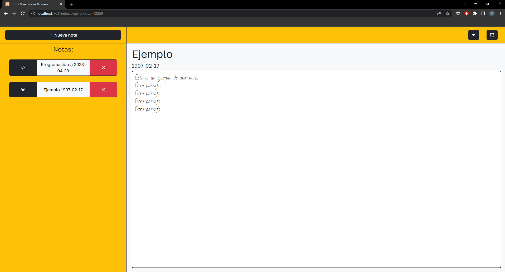

- [Gestor de Notas](#gestor-de-notas)
  - [Antecedentes](#antecedentes)
- [REQUISITOS](#requisitos)
  - [Requisitos funcionales](#requisitos-funcionales)
- [ANÁLISIS Y DISEÑO WEB](#análisis-y-diseño-web)
  - [Guía de estilos](#guía-de-estilos)
  - [Prototipo web y boceto de la estructura](#prototipo-web-y-boceto-de-la-estructura)
  - [Planificación de tareas](#planificación-de-tareas)
  - [Base de datos](#base-de-datos)
    - [Diseño Entidad Relación de la BBDD](#diseño-entidad-relación-de-la-bbdd)
    - [Modelo relacional BBDD](#modelo-relacional-bbdd)
    - [Script de creación BBDD](#script-de-creación-bbdd)
    - [Consultas](#consultas)
  - [Validación de formularios](#validación-de-formularios)
  - [Jerarquía de directorios](#jerarquía-de-directorios)
    - [Contenido directorios](#contenido-directorios)
  - [Diseño de la interface](#diseño-de-la-interface)
    - [Estructura gráfica de la interface](#estructura-gráfica-de-la-interface)
- [PRUEBAS](#pruebas)
  - [Diseño de casos de prueba](#diseño-de-casos-de-prueba)
  - [Implementación de pruebas](#implementación-de-pruebas)
  - [Análisis de resultados](#análisis-de-resultados)
- [DESPLIEGUE](#despliegue)
- [HERRAMIENTAS](#herramientas)
- [LENGUAJES](#lenguajes)
- [PRODUCTO](#producto)
  - [Página de Inicio](#página-de-inicio)
- [BIBLIOGRAFÍA](#bibliografía)

# Gestor de notas
## Antecedentes

El Gestor de Notas surge de la necesidad de tener un sistema para guardar notas que permita una personalización más completa y una mejor organización de las mismas.

# REQUISITOS
## Requisitos funcionales

R1: Registro de nota.
R1.1: El usuario deberá de rellanar la fecha y título de la nota.
R2: Administración de notas.
R2.2: El usuario podrá crearlas, editarlas y borrarlas.
R2.2: El usuario podrá escribir en ellas.


Además de los requisitos funcionales, están los siguientes:

- R1. Diseño responsive
- R2. Control de errores en formularios que deben incluir como mínimo un registro de notas.
- R2.1 El registro de notas contendrá los siguientes campos: 
  - Título
  - Fecha

# ANÁLISIS Y DISEÑO WEB
## Guía de estilos

Colores primarios corporativos:
- #f2b269
- #ffffff

Colores secundarios:
- #6c757d
- #000000
- #FF0000

## Prototipo web boceto de la estructura


## Logotipo


## Planificación de tareas


## Base de datos
### Diseño Entidad Relación de la BBDD


### Modelo relacional BBDD


### Script de creación BBDD

``` [sql]
-- phpMyAdmin SQL Dump
-- version 5.2.0
-- https://www.phpmyadmin.net/
--
-- Servidor: 127.0.0.1
-- Tiempo de generación: 12-05-2023 a las 18:09:45
-- Versión del servidor: 8.0.32
-- Versión de PHP: 8.2.0

SET SQL_MODE = "NO_AUTO_VALUE_ON_ZERO";
START TRANSACTION;
SET time_zone = "+00:00";


/*!40101 SET @OLD_CHARACTER_SET_CLIENT=@@CHARACTER_SET_CLIENT */;
/*!40101 SET @OLD_CHARACTER_SET_RESULTS=@@CHARACTER_SET_RESULTS */;
/*!40101 SET @OLD_COLLATION_CONNECTION=@@COLLATION_CONNECTION */;
/*!40101 SET NAMES utf8mb4 */;


/* En el siguiente párrafo se crea la tabla "gestor_notas" en el caso de que no exista. Con el comando "USE" lo que hace es utilizar la base de datos que se indica (gestor_notas) */;
--
-- Base de datos: `gestor_notas`
--
CREATE DATABASE IF NOT EXISTS `gestor_notas` DEFAULT CHARACTER SET utf8mb3 COLLATE utf8mb3_spanish_ci;
USE `gestor_notas`;

-- --------------------------------------------------------

--
-- Estructura de tabla para la tabla `iconos`
--

CREATE TABLE `iconos` (
  `Nombre` varchar(65) COLLATE utf8mb3_spanish_ci NOT NULL,
  `id_icono` int NOT NULL,
  `link_icono` text CHARACTER SET utf8mb3 COLLATE utf8mb3_spanish_ci NOT NULL
) ENGINE=InnoDB DEFAULT CHARSET=utf8mb3 COLLATE=utf8mb3_spanish_ci;

-- --------------------------------------------------------

--
-- Estructura de tabla para la tabla `notas`
--

CREATE TABLE `notas` (
  `id_nota` int NOT NULL,
  `titulo` varchar(20) CHARACTER SET utf8mb3 COLLATE utf8mb3_spanish_ci NOT NULL,
  `fecha` date NOT NULL,
  `texto` text COLLATE utf8mb3_spanish_ci NOT NULL,
  `id_icono` int NOT NULL
) ENGINE=InnoDB DEFAULT CHARSET=utf8mb3 COLLATE=utf8mb3_spanish_ci;

--
-- Índices para tablas volcadas
--


/*Añadimos llave primaria a la columna "iconos"*/;
--
-- Indices de la tabla `iconos`
--
ALTER TABLE `iconos`
  ADD PRIMARY KEY (`id_icono`);


/*Añadimos llave primaria a la columna "id_notas" y un índice a la columna "id_icono" para posteriormente añadirle una foreing key*/;
--
-- Indices de la tabla `notas`
--
ALTER TABLE `notas`
  ADD PRIMARY KEY (`id_nota`),
  ADD KEY `id_icono` (`id_icono`);

--
-- Restricciones para tablas volcadas
--


/*Aquí abajo lo que hacemos es crear la foreing key en "id_icono" de la tabla "iconos", haciendo referencia a la columna "id_icono" de la tabla notas */;
--
-- Filtros para la tabla `notas`
--
ALTER TABLE `notas`
  ADD CONSTRAINT `notas_ibfk_1` FOREIGN KEY (`id_icono`) REFERENCES `iconos` (`id_icono`);
COMMIT;

/*!40101 SET CHARACTER_SET_CLIENT=@OLD_CHARACTER_SET_CLIENT */;
/*!40101 SET CHARACTER_SET_RESULTS=@OLD_CHARACTER_SET_RESULTS */;
/*!40101 SET COLLATION_CONNECTION=@OLD_COLLATION_CONNECTION */;
```

### Consultas 

Consultas utilizadas en el proyecto:
``` [sql]

SELECT id_nota, titulo, fecha, texto, id_icono FROM notas

SELECT nombre, id_icono, link_icono FROM iconos

SELECT link_icono FROM iconos WHERE id_icono = :id_icono

SELECT titulo, fecha, texto, id_nota FROM notas WHERE id_nota = :id_nota

DELETE FROM notas WHERE id_nota = :id_nota

UPDATE notas SET id_icono = :id_icono WHERE id_nota = :id_nota

UPDATE notas SET texto = :texto WHERE id_nota = :id_nota

INSERT INTO notas(id_nota, titulo, fecha, texto, id_icono) VALUES (:id_nota, :titulo, :fecha, :texto, :id_icono)

```

## Validación de formularios

En el siguiente formulario lo que validamos son los inputs con id "fecha" y "titulo". La validación de estos trata en exigir que el título contenga entre 3 y 3 carácteres del abecedario, y la fecha tiene que estar escrita en el formato "YYYY/MM/DD".
``` [html]
<form class="formulario" id="formulario" action="config/register.php" method="post">
  <div class="modal-body">
    <div class="mb-3">
      <label for="exampleFormControlInput1" class="form-label">Introduzca una fecha</label>
      <input type="text" id="fecha" name="reg_fecha" class="form-control" id="exampleFormControlInput1" placeholder="Ejemplo de fecha -> 2023/07/23" />
    </div>
    <div class="mb-3">
      <label for="exampleFormControlInput1" class="form-label">Introduzca un título</label>
      <input type="text" id="titulo" name="reg_titulo" class="form-control" id="exampleFormControlInput1" placeholder="Ejemplo de título -> Poema atardecer" />
    </div>
  </div>
  <div class="modal-footer">
    <button type="button" class="btn btn-secondary" data-bs-dismiss="modal">
      Cerrar
    </button>
    <input type="submit" name="crear" class="btn btn-warning boton" id="btn-agregar" value="Crear nota"></input>
  </div>
</form>
```

## Jerarquía de directorios


### Contenido directorios

> `./` -> Contiene los ficheros principales “index.php” y “style.css”.
> 
> `audio` -> Contiene el arcivo "ringtone.mp3" que básicamente es el tono de alarma.
> 
> `config` -> Contiene los archivos "borrar.php", "cambiar_icono.php", "database.php", "register_textarea.php" y "register.php".
> 
> `script` -> Contiene los archivos "alarma.js", "script.js" y "textarea.js".

## Diseño de la interface

> El sitio web consta de tres partes fundamentales. Esta estructura es común en todas las páginas que forman el sitio web.
> 
> **Cabecera**: Contiene 3 botones, el de creación de nota, el de cambiar icono, y por último un botón para añadir una alarma. A demás, al ser responsive, cuando el width baja de 992px, se quita el botón de "crear nota" y se añade un botón de menú.
> 
> **Aside**: Esta ubicado justo debajo del botón de "crear nota", en el lateral izquierdo. Contiene las notas, que son 3 botones; el primer botón no es funcional, sirve simplemente para mostrar el icono de la nota, el segundo botón sirve para mostrar la nota pulsada por pantalla, y el tercer botón sirve para eliminar la nota.
>
> **Cuerpo**: Muestra en la parte superior el título en grande, abajo del mismo la fecha un poco más pequeña, y debajo de la fecha, el textarea que cubre toda la pantalla restante.

### Estructura gráfica de la interface

Mostramos la estructura gráfica de nuestro diseño. Por ejemplo.


# PRUEBAS

El objetivo de las pruebas es garantizar que la aplicación sea confiable, segura, eficiente y fácil de usar para los usuarios. El proceso de pruebas los vamos a dividir en tres etapas:

- Diseño de casos de prueba
- Implementación de pruebas
- Análisis de resultados

## Diseño de casos de prueba

> Nombre del caso de prueba: **Creación de nota exitosa**
> 
> Descripción: El objetivo de este caso de prueba es verificar que se pueda crear una nota en la aplicación web de manera exitosa utilizando una fecha y un título válido.
> 
> Pasos: 
> 
> - Pulsar el botón de "Nueva nota" y acceder a la interfaz de ella.
> - Ingresar la fecha en el campo "Fecha".
> - Ingresar el título en el campo "Título".
> - Hacer clic en el botón "Crear nota".
> 
> Resultados esperados:
> - La aplicación web debe validar los valores de los campos introducidos y registrar la nota en la base de datos.
> - El usuario debe de ver la nota creada en la columna de la izquierda.
> 
> Condiciones de aprobación:
> 
> - Si la aplicación web valida los valores de los campos introducidos y registra la nota en la base de datos, el caso de prueba se considera aprobado.
> - Si la aplicación web no valida los valores de los campos introducidos o no se registra la nota en la base de datos, el caso de prueba se considera fallido.

> Nombre del caso de prueba: **Cambio de icono en una nota**
> 
> Descripción: El objetivo de este caso de prueba es verificar que se pueda cambiar el icono en una nota en la aplicación web de manera exitosa.
> 
> Pasos: 
> 
> - Pulsar el botón con una flecha para abajo y accede a la interfaz de cambio de icono.
> - Pulsar un icono cualquiera de los mostrados.
> 
> Resultados esperados:
> - La aplicación web debe cambiar el icono de la nota seleccionada.
> - El usuario debe de ver el nuevo icono de la nota en la columna de la izquierda.
> 
> Condiciones de aprobación:
> 
> - Si el icono de la nota seleccionada se ha cambiado en la nota y en la base de datos, el caso de prueba se considera aprobado.
> - Si el icono de la nota seleccionada no se cambia en la nota o en la base de datos, el caso de prueba se considera fallido.

> Nombre del caso de prueba: **Eliminación de nota exitosa**
> 
> Descripción: El objetivo de este caso de prueba es verificar que se pueda eliminar una nota en la aplicación web.
> 
> Pasos: 
> 
> - Pulsar el botón de "X" de la nota que quiera eliminar.
> - Aceptar el mensaje de advertencia de "¿Estás seguro de que quieres borrar esta nota?".
> 
> Resultados esperados:
> - La aplicación web debe eliminar la nota en la base de datos.
> - El usuario no debe de ver la nota eliminada previamente en la columna de la izquierda.
> 
> Condiciones de aprobación:
> 
> - Si la aplicación web elimina la nota en la base de datos y no se muestra, el caso de prueba se considera aprobado.
> - Si la aplicación web no elimina la nota en la base de datos o se sigue mostrando, el caso de prueba se considera fallido.

> Nombre del caso de prueba: **Creación de alarma**
> 
> Descripción: El objetivo de este caso de prueba es verificar que se puede crear una alarma en la aplicación web de manera exitosa.
> 
> Pasos: 
> 
> - Pulsar el botón con un reloj y accede a la interfaz de creación de alarma.
> - Ingresar la hora en el campo "Hora".
> - Ingresar los minutos en el campo "Minutos".
> - Ingresar si queremos que sueno por la mañana o por la tarde en el campo "AM/PM".
> 
> Resultados esperados:
> - Los campos se desactivarán para que no se puedan cambiar una vez ya creada la alarma. En cualquier caso se podría quitar la alarma.
> - Donde antes había un botón que ponía "Crear alarma", ahora hay uno que pone "Quitar alarma".
> 
> Condiciones de aprobación:
> 
> - Si la alarma suena a la hora seleccionada, el caso de prueba se considera aprobado.
> - Si la alarma no suena a la hora seleccionada, el caso de prueba se considera fallido.

## Implementación de pruebas

> Caso de prueba: CP1. Creación de nota exitosa
>
> Se realiza una prueba manual de creación de notas con las siguientes casuísticas:
>
> - CP1.1 Creación de nota con título y fecha válidas.
> - CP1.2 Creación de nota con título o fecha no válidas.
>

> Caso de prueba: CP2. Cambio de icono en una nota
>
> Se realiza una prueba manual de cambio de icono de una nota con las siguientes casuísticas:
>
> - CP2.1 Cambio de icono en una nota válida.
> - CP2.2 Cambio de icono en una nota no válida.
>

> Caso de prueba: CP3. Eliminación de nota exitosa
>
> Se realiza una prueba manual de eliminación de notas con la siguiente casuística:
>
> - CP3.1 Eliminación de una nota ya existente.
> - CP3.2 Eliminación de una nota recién creada.
>

> Caso de prueba: CP4. Creación de alarma
>
> Se realiza una prueba manual de creación de alarma con las siguientes casuísticas:
>
> - CP4.1 Creación de alarma.
> - CP4.2 Creación de alarma con campos escogidos aleatoriamente.
> - CP4.3 Quitar alarma creada.
> - CP4.4 Crear alarma, quitarla y volverla a crear.
>

## Análisis de resultados 

> 
> | Casos de prueba       |   |
> |-----------------------|:-:|
> | CP1. Creación de nota | Resultado | 
> | CP1.1                 | Ok   | 
> | CP1.2                 | Ok   | 
>
> Se han realizado varias pruebas, de las cuales ninguna me ha dado fallos. He probado todo tipo de valores para los campos pero todo ha ido como debería de ir.
>

> 
> | Casos de prueba       |   |
> |-----------------------|:-:|
> | CP2. Cambio de icono | Resultado | 
> | CP2.1                 | Ok   | 
> | CP2.2                 | Ok   | 
>
> Se han probado todos los iconos disponibles, y todos se han mostrado sin problema alguno.
>

> 
> | Casos de prueba       |   |
> |-----------------------|:-:|
> | CP3. Cambio de icono | Resultado | 
> | CP3.1                 | Ok   | 
> | CP3.2                 | Ok   | 
>
> Se ha borrado notas desde ya creadas hasta creadas recientemente y ninguna ha dado fallos.
>

> 
> | Casos de prueba       |   |
> |-----------------------|:-:|
> | CP4. Cambio de icono | Resultado | 
> | CP4.1                 | Ok   | 
> | CP4.2                 | Ok   | 
> | CP4.3                 | Ok   | 
> | CP4.4                 | Ok   | 
>
> Se ha probado todos los casos de prueba, que son todas las pruebas posibles de la alarma, y todas han pasado las pruebas con un aprobado.
>

# DESPLIEGUE

``` [bash]

#!/bin/bash
#
# Script en bash de despliegue del proyecto de final de grado (TFG).
#
# Marcos Zea Moreno

# Variables de entorno
USERDB="debianDB"
PASSDB="debianDB"
HOST=$(hostname -I)
WWW="/var/www/html/"

# Fichero con los datos de la base de datos del proyecto
DATOS="Datos.sql"
BBDD="gestor_notas"

# Se toman los parámetros como USER y PASS de la BBDD
if [ $# = 2 ];
then
   USERDB=$1
   PASSDB=$2
fi

# Copiamos el contenido de la carpeta proyecto a la página html
cp -r ../Codigo/* $WWW

# Restauramos los datos de ejemplo a la BBDD
mysqladmin -u $USERDB -p$USERDB create $BBDD
mysql -u $USERDB -p$USERDB $BBDD < ../DataBase/$DATOS

# Mostramos url de carga
echo "http://$HOST/index.php" | tr -d '[[:space:]]'

```

# HERRAMIENTAS

> Para la realización del proyecto se han empleado las siguientes herramientas:
> ## Visual Studio
> 
> Visual Studio es una herramienta de desarrollo eficaz que permite completar todo el ciclo de desarrollo en un solo lugar. Es un entorno de desarrollo integrado (IDE) completo que puede usar para escribir, editar, depurar y compilar el código y, luego, implementar la aplicación.
> 
> ### Características
> 
> Instalación modular.
> Creación de aplicaciones Azure.
> Creación de aplicaciones web.
> Creación de aplicaciones y juegos multiplataforma.
> Conectarse a bases de datos.
> Depurar, probar y mejorar el código.
> Implementación de aplicaciones.
> 

# LENGUAJES
> ## HTML
> 
> El Lenguaje de Marcado de Hipertexto (HTML) es el código que se utiliza para estructurar y desplegar una página web y sus contenidos. Por ejemplo, sus contenidos podrían ser párrafos, una lista con viñetas, o imágenes y tablas de datos
> 
> ### Características
> 
> Es fácil de usar y entender.
> Es utilizado para crear páginas web.
> Permite describir hipertextos.
> Permite que el usuario se mueva por cualquier sitio de Internet haciendo clic en un texto específico —hipervínculo—.  
>

> ## Javascript
> 
> JavaScript es un lenguaje de programación diseñado en un principio para añadir interactividad a las páginas webs y crear aplicaciones web. A pesar de la similitud en el nombre, no está relacionado con Java. Se emplea en el desarrollo de páginas web para tareas como cambiar automáticamente la fecha de una página, hacer que una página aparezca en una ventana emergente al hacer clic en un enlace o que un texto o imagen cambien al pasar el ratón por encima. También suele emplearse para hacer encuestas y formularios. Se ejecuta en el ordenador del visitante a la web, por lo que no requiere descargas constantes desde el sitio web.
> 
> ### Características
> 
> Simplicidad. Posee una estructura sencilla que lo vuelve más fácil de aprender e implementar.
> Velocidad. Se ejecuta más rápido que otros lenguajes y favorece la detección de los errores.
> Versatilidad. Es compatible con otros lenguajes, como: PHP, Perl y Java.
> Popularidad.
> Carga del servidor.
> Actualizaciones  
> 

> ## Php
> 
> PHP es el acrónimo recursivo de Hypertext Preprocessor, un lenguaje de programación de código abierto muy utilizado especialmente en el desarrollo de aplicaciones y web, este lenguaje de código puede ser incrustado en HTML5 puesto que es un código muy variable favorece el enlace entre la interfaz de usuario y los servidores.
> 
> ### Características
> 
> lenguaje muy potente
> Gran extensión de documentación.
> Variedad de herramientas para aprender.
> Mucha oferta de trabajo.
> Permite programación orientada a objetos.
> Módulos externos para mejorar la aplicación web.
> Se puede separar la estructura.
> La libertad es un bien muy preciado. 
> 

> ## Css
> 
> Abreviado en sus siglas en inglés, Cascading Style Sheets, que significa hojas de estilo en cascada, el CSS es una función que se agrega a HTML que proporciona tanto a los desarrolladores de sitios Web, así como a los usuarios, más control sobre cómo se muestran las páginas. Con CSS, los diseñadores y los usuarios pueden crear hojas de estilo que definen cómo aparecen los diferentes elementos, como los encabezados y los enlaces. Estas hojas de estilo se pueden aplicar a cualquier página Web, y nos permite optimizarla para mejorar su posicionamiento.
> 
> ### Características
> 
> Es un lenguaje de programación diferente a HTML.
> Permite el apilamiento de instrucciones para definir formatos específicos.
> Es utilizable en todos los navegadores y plataformas.
> Optimiza el funcionamiento de las páginas web.
> Tiene una sintaxis específica. 
> 

> ## Sql
> 
> La sigla que se conoce como SQL corresponde a la expresión inglesa Structured Query Language (entendida en español como Lenguaje de Consulta Estructurado), la cual identifica a un tipo de lenguaje vinculado con la gestión de bases de datos de carácter relacional que permite la especificación de distintas clases de operaciones entre éstas. Gracias a la utilización del álgebra y de cálculos relacionales, el SQL brinda la posibilidad de realizar consultas con el objetivo de recuperar información de las bases de datos de manera sencilla.
> 
> ### Características
> 
> Lenguaje estandarizado. Estandarizado en 1986, el lenguaje de programación SQL permite desplegar implementaciones del mismo en diferentes sistemas, usando prácticamente el mismo código para todos ellos.
> Integridad de los datos.
> Flexibilidad.
> Sencillez y claridad.  
> 

> ## Bash
> 
> Un script de shell es un archivo de texto que contiene uno o más comandos UNIX. Los scripts de shell sirven para ejecutar los comandos que, de otro modo, introducirías en la línea de comandos.
> 
> ### Características
> 
> Son fáciles de programarse.
> Tienen un mayor costo de procesamiento cuando son ejecutados.
> Usan intérpretes en lugar de compiladores para ejecutarse.
> Pueden interactuar o comunicarse con componentes escritos en otros lenguajes de programación.  
> 

# PRODUCTO
## Inicio:


## Nota seleccionada:


## Creación de nota:


## Cambiar icono:


## Crear alarma:


# BIBLIOGRAFÍA

Para el desarrollo de mi proyecto he empleado el uso de bootstrap, repositorios de github y stackoverflow.
Para las fuentes he utilizado GoogleFonts y para el logo utilicé logomakr.